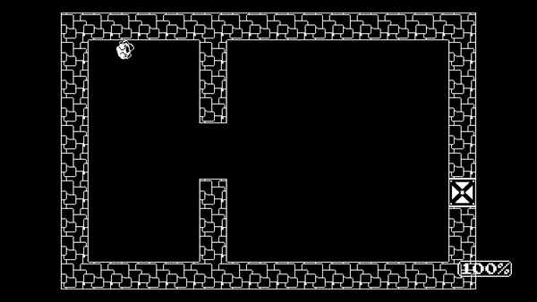
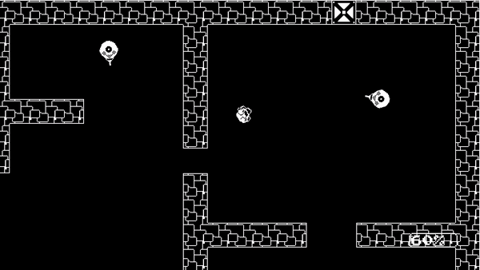

# Agent 001

A top down shooter about Agent 001 who must brave the 1 bit world by avoiding the dangerous enemies on patrol all in the quest to rescue the sacred 1-bit flame!

## About

This repository hosts source code for [Agent-001](https://ufrshubham.itch.io/agent-001), a game that we created for the [Midyear 2022 Flame Game Jam](https://itch.io/jam/2nd-flame-game-jam). Theme for this jam was `1-bit`.

Adhering to the theme, all art assets use only 2 colors and all of them were self made using [Minisprite](https://minisprit.es/). All music was written with 1 bit restrictions as well, meaning, only 2 notes are ever played - F & B flat.

[Play it on itch](https://ufrshubham.itch.io/agent-001)

## Demo

## Controls

- WASD/Arrow keys : Movement
- Mouse : Aiming
- Space : Fire
